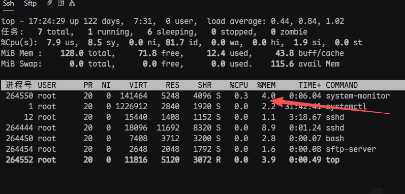
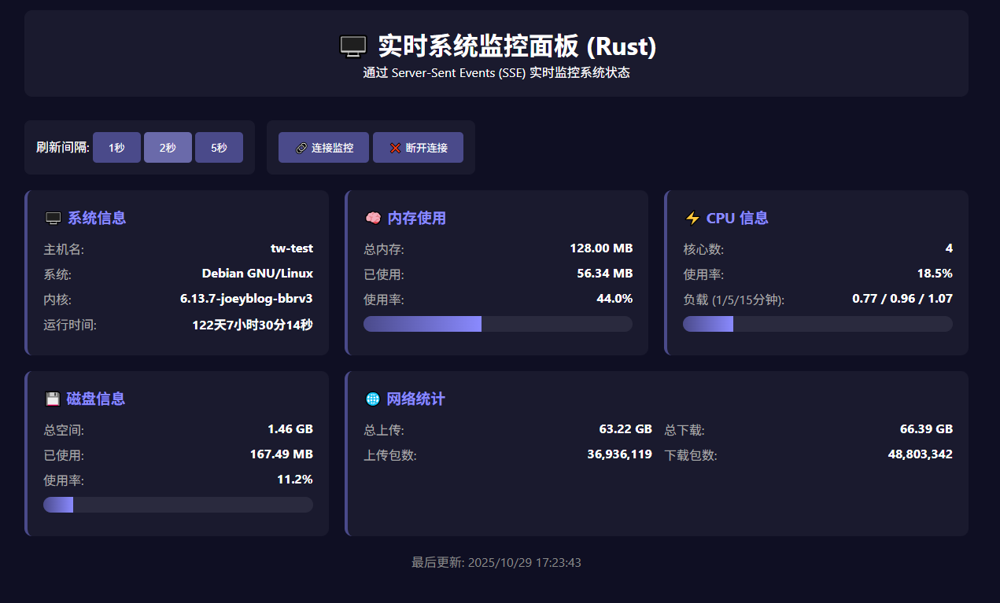

# 系统信息监控程序

## 1、deno实现版本

### 编译程序
```
deno compile --allow-all -o system-monitor main.ts
```

### 运行程序
```
./system-monitor

./system-monitor 3000 # 指定监听端口

./system-monitor -h # 显示帮助信息
```

### 使用方法
```
用法:
  deno run -A main.ts [端口]
  deno run -A main.ts 3000

选项:
  --help, -h    显示帮助信息

默认端口: 8080

端点:
  GET /      网页监控界面
  GET /sse   SSE 流式监控
  GET /api   JSON API

示例:
  # 启动服务器
  deno run -A main.ts

  # 使用 curl 测试 SSE
  curl -N http://localhost:8080/sse

  # 使用 curl 测试 API
  curl http://localhost:8080/api

```

### 常驻进程运行

### 创建服务文件
```
vim /etc/systemd/system/system-monitor.service
```

### 编辑服务配置
```
[Unit]
Description=System Monitor Service
After=network.target
Wants=network.target

[Service]
Type=simple
User=monitor
Group=monitor
WorkingDirectory=/var/app/system-monitor
ExecStart=/var/app/system-monitor/system-monitor 3000
ExecReload=/bin/kill -HUP $MAINPID
Restart=always
RestartSec=10

# 安全设置
NoNewPrivileges=yes
PrivateTmp=yes
ProtectSystem=strict
ProtectHome=yes
ReadWritePaths=/var/app/system-monitor /var/log
ProtectKernelTunables=yes
ProtectKernelModules=yes
ProtectControlGroups=yes

# 资源限制
MemoryLimit=20M
CPUQuota=40%

# 日志
StandardOutput=journal
StandardError=journal
SyslogIdentifier=system-monitor


[Install]
WantedBy=multi-user.target
```

### 启用并启动服务

```
# 重新加载 systemd 配置
sudo systemctl daemon-reload

# 启用开机自启
sudo systemctl enable system-monitor.service

# 启动服务
sudo systemctl start system-monitor.service

# 查看状态
sudo systemctl status system-monitor.service

# 查看日志
sudo journalctl -u system-monitor.service -f
```


## 2、rust实现版本

### 编译程序
```
cargo build --release
```

### 运行程序
```
./system-monitor

./system-monitor 3000 # 指定监听端口

./system-monitor -h # 显示帮助信息
```

### 使用方法
```
用法:
  cargo run -- [端口]
  cargo run -- 3000

选项:
  --help, -h    显示帮助信息

默认端口: 8080

端点:
  GET /      网页监控界面
  GET /sse   SSE 流式监控
  GET /api   JSON API

示例:
  # 启动服务器
  cargo run

  # 使用 curl 测试 SSE
  curl -N http://localhost:8080/sse

  # 使用 curl 测试 API
  curl http://localhost:8080/api

```

### 常驻进程运行

### 创建服务文件
```
vim /etc/systemd/system/system-monitor.service
```

### 编辑服务配置
```
[Unit]
Description=System Monitor Service
After=network.target
Wants=network.target

[Service]
Type=simple
User=monitor
Group=monitor
WorkingDirectory=/var/app/system-monitor
ExecStart=/var/app/system-monitor/system-monitor 3000
ExecReload=/bin/kill -HUP $MAINPID
Restart=always
RestartSec=10

# 安全设置
NoNewPrivileges=yes
PrivateTmp=yes
ProtectSystem=strict
ProtectHome=yes
ReadWritePaths=/var/app/system-monitor /var/log
ProtectKernelTunables=yes
ProtectKernelModules=yes
ProtectControlGroups=yes

# 资源限制
MemoryLimit=20M
CPUQuota=40%

# 日志
StandardOutput=journal
StandardError=journal
SyslogIdentifier=system-monitor


[Install]
WantedBy=multi-user.target
```

### 启用并启动服务

```
# 重新加载 systemd 配置
sudo systemctl daemon-reload

# 启用开机自启
sudo systemctl enable system-monitor.service

# 启动服务
sudo systemctl start system-monitor.service

# 查看状态
sudo systemctl status system-monitor.service

# 查看日志
sudo journalctl -u system-monitor.service -f
```

### rust版轻量级，性能消耗，以及示例

性能消耗：
1. 运行时内存占用：1.5M
2. 运行时CPU占用：0.5%
3. 运行时网络带宽占用：0.5M
4. 运行时磁盘IO占用：0.5M


图片示例1：


图片示例2：
